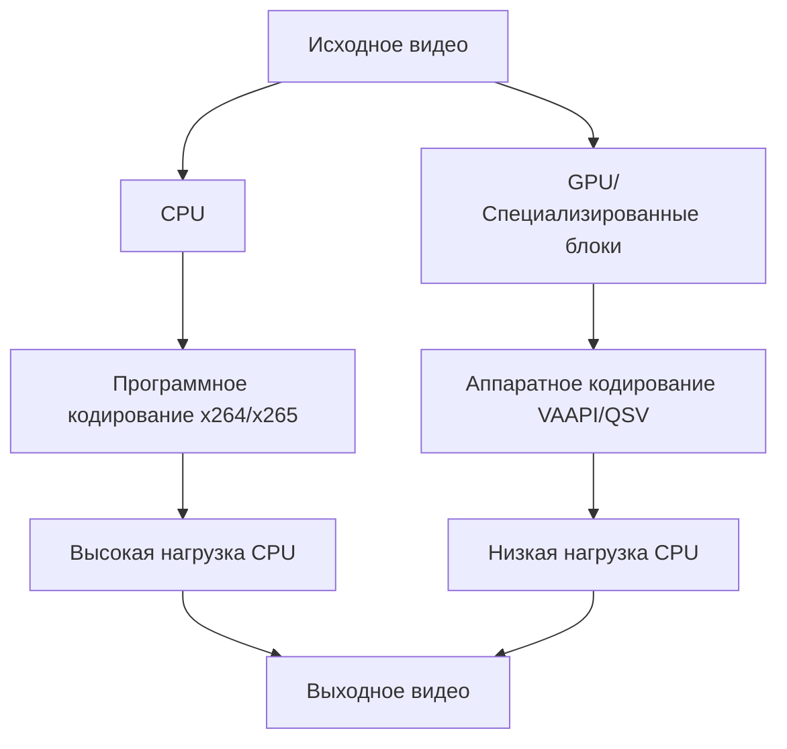
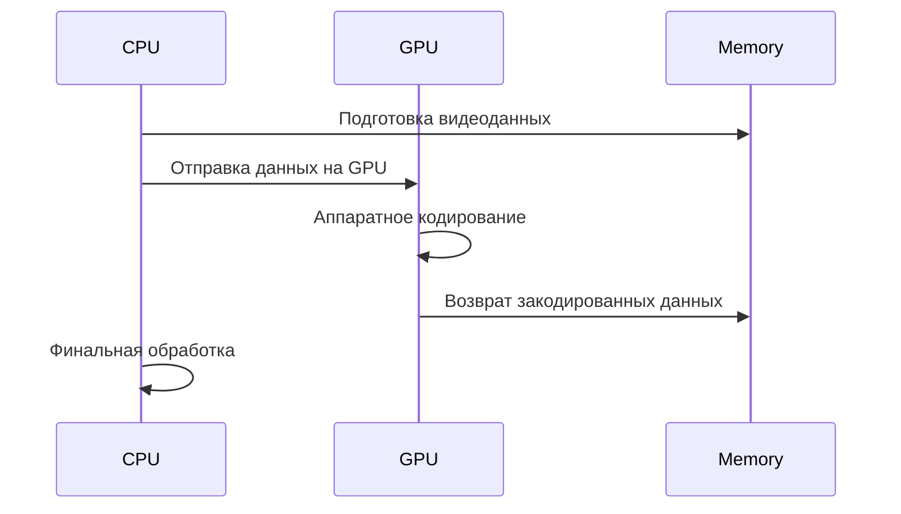
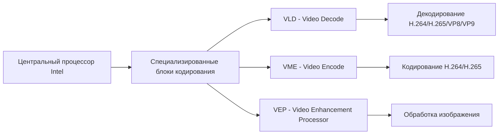
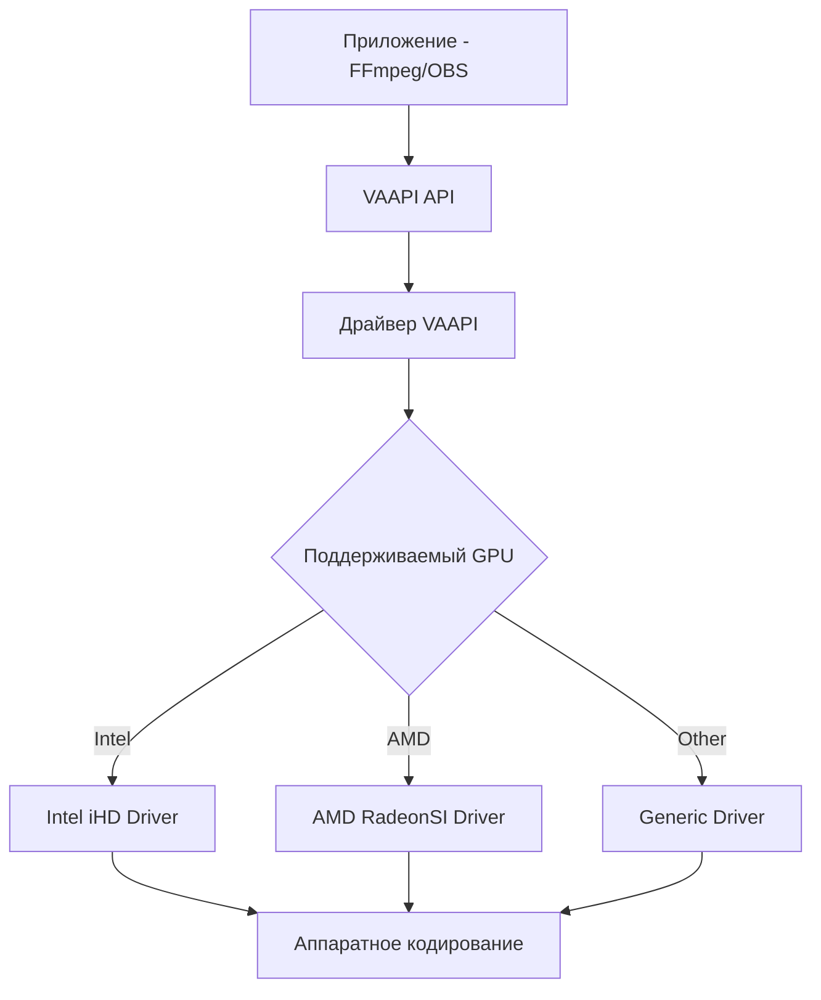
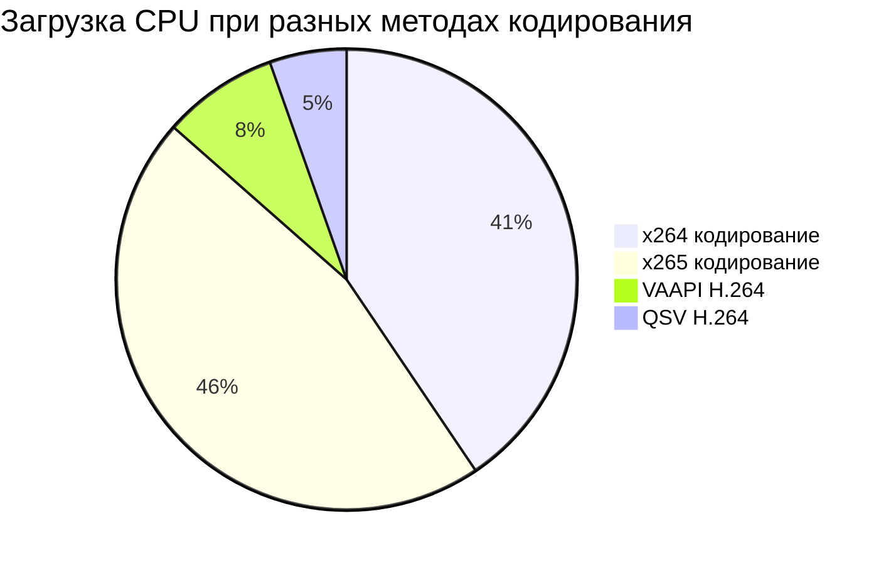
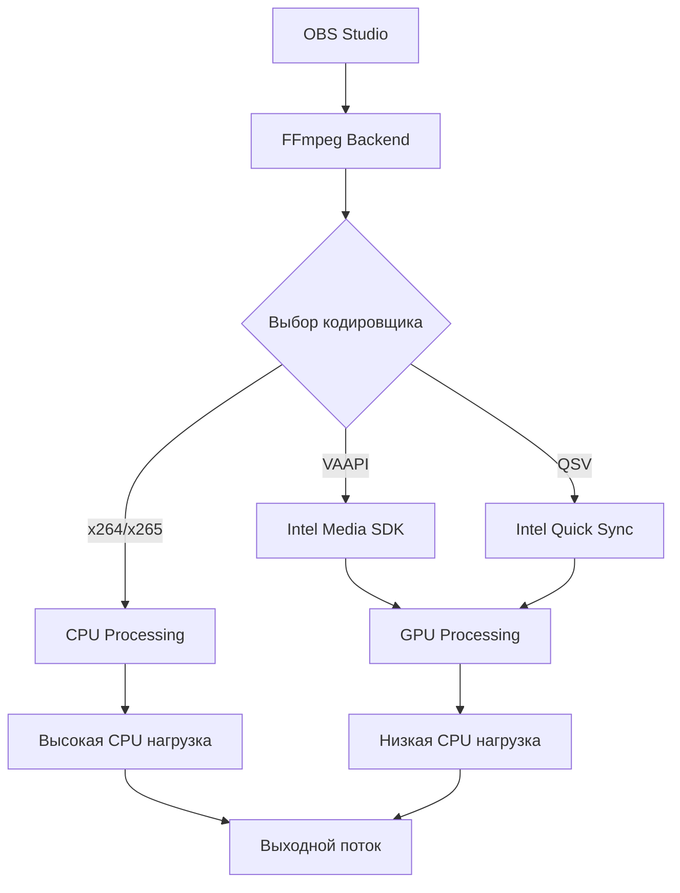

# Полное руководство по OBS Studio, FFmpeg и настройке кодеков в Gentoo Linux (Niri/Wayland)

## Быстрый старт (для новичков) {: #быстрый-старт } {: .beginner }
**Уровень сложности: Новичок**
Если вы новичок, выполните следующие шаги:

1. Убедитесь, что ваш процессор поддерживает аппаратное кодирование (Intel QSV, AMD VCE или NVIDIA NVENC)
2. Установите необходимые пакеты:
   ```bash
   emerge -av media-video/obs-studio media-video/ffmpeg media-libs/svt-av1
   ```
3. Включите USE-флаги для аппаратного ускорения:
   ```
   media-video/ffmpeg vaapi qsv vpl av1 x264 x265 pipewire drm gpl pgo
   media-video/obs-studio pipewire wayland av1 qsv vpl v4l fdk speex
   ```
4. Для Intel GPU установите драйверы:
   ```bash
   emerge -av media-libs/libva-intel-media-driver media-libs/vpl-gpu-rt media-video/libva-utils
   ```
5. Добавьте себя в группы:
   ```bash
   usermod -a -G video,render $USER
   ```
6. Перезагрузите систему и запустите OBS Studio
7. В настройках вывода (Output) выберите кодировщик "FFmpeg VAAPI H.264" для стриминга или "FFmpeg VAAPI HEVC" для записи

## Содержание
1. [Быстрый старт (для новичков)](#быстрый-старт) - **Новичок**
2. [Что такое FFmpeg](#что-такое-ffmpeg) - **Новичок**
3. [Альтернативы FFmpeg](#альтернативы-ffmpeg) - **Новичок**
4. [Проверка совместимости оборудования](#проверка-совместимости-оборудования) - **Новичок**
5. [Как работает FFmpeg в системах Gentoo](#как-работает-ffmpeg-в-системах-gentoo) - **Средний**
6. [Интеграция FFmpeg с OBS Studio](#интеграция-ffmpeg-с-obs-studio) - **Средний**
7. [USE-флаги в Gentoo для функциональности FFmpeg](#use-флаги-в-gentoo-для-функциональности-ffmpeg) - **Средний**
8. [Программные кодировщики (x264, x265)](#программные-кодировщики-x264-x265) - **Средний**
9. [Кодек AV1 — «Новый стандарт»](#кодек-av1-—-«новый-стандарт») - **Средний**
10. [Аппаратные кодировщики (VAAPI, QSV)](#аппаратные-кодировщики-vaapi-qsv) - **Средний**
11. [Настройка Intel Quick Sync Video в Gentoo](#настройка-intel-quick-sync-video-в-gentoo) - **Средний**
12. [Различия между программным и аппаратным кодированием](#различия-между-программным-и-аппаратным-кодированием) - **Средний**
13. [Методы управления битрейтом (CBR, CQP, CRF)](#методы-управления-битрейтом) - **Средний**
14. [Интеграция PipeWire для окружений Wayland/Niri](#интеграция-pipewire-для-окружений-waylandniri) - **Продвинутый**
15. [Безопасность в среде Wayland](#безопасность-в-среде-wayland) - **Продвинутый**
16. [Резервное копирование и восстановление](#резервное-копирование-и-восстановление) - **Средний**
17. [Совместимость версий программного обеспечения](#совместимость-версий-программного-обеспечения) - **Средний**
18. [Вспомогательные скрипты](#вспомогательные-скрипты) - **Продвинутый**
19. [Устранение неполадок](#устранение-неполадок) - **Продвинутый**
20. [Сравнение производительности](#сравнение-производительности) - **Средний**
21. [Мониторинг производительности](#мониторинг-производительности) - **Продвинутый**
22. [Практические примеры конфигураций](#практические-примеры-конфигураций) - **Средний**

## Что такое FFmpeg {: .beginner }
**Уровень сложности: Новичок**

FFmpeg - это мощный набор инструментов с открытым исходным кодом для обработки аудио- и видеоданных. Он включает в себя библиотеки и командные инструменты для транскодирования, монтажа, потоковой передачи и фильтрации мультимедийных файлов.

Основные компоненты FFmpeg:
- `ffmpeg` - универсальный транскодер для аудио/видео
- `ffplay` - простой аудио/видео проигрыватель
- `ffprobe` - информация о мультимедийных файлах
- Библиотеки: libavcodec, libavformat, libavutil, libswscale и другие

FFmpeg поддерживает огромное количество форматов и кодеков, что делает его незаменимым инструментом для работы с мультимедиа.

## Альтернативы FFmpeg {: .beginner }
**Уровень сложности: Новичок**

### GStreamer
Фреймворк для создания потоковых мультимедийных приложений, который может использоваться вместо FFmpeg для некоторых задач обработки видео.

**Сравнение GStreamer и FFmpeg:**

| Критерий | GStreamer | FFmpeg |
|----------|-----------|---------|
| Архитектура | Плагинная архитектура с элементами и бинами | Монолитная библиотека с богатым API |
| Сложность изучения | Более сложная для начинающих | Более простая для базового использования |
| Гибкость | Высокая гибкость для сложных пайплайнов | Хорошая гибкость, но с ограничениями |
| Поддержка форматов | Хорошая поддержка через плагины | Отличная поддержка большинства форматов |
| Производительность | Зависит от конфигурации пайплайна | Обычно очень высокая |
| Интеграция с GUI | Хорошо интегрируется с GTK-приложениями | Часто используется как бэкенд для GUI-приложений |
| Сообщество | Активное сообщество, особенно в GNOME-экосистеме | Очень большое и активное сообщество |
| Документация | Хорошая документация с примерами | Обширная документация и большое количество примеров |

**Когда использовать GStreamer:**
- При создании сложных мультимедийных приложений с уникальной обработкой
- Если вы уже используете GNOME-технологии
- Для приложений, требующих динамической перестройки пайплайнов
- В embedded-системах с особыми требованиями к обработке

**Когда использовать FFmpeg:**
- Для традиционных задач кодирования/декодирования видео
- При необходимости максимальной совместимости с форматами
- Для командной строки и автоматизации задач
- При разработке бэкендов для существующих приложений

### HandBrake
Графический интерфейс для перекодировки видео, использующий собственные библиотеки, но также может использовать FFmpeg в качестве одного из движков.

### Avidemux
Простой редактор видео, предназначенный для копирования и базового редактирования видеофайлов.

### VLC (VideoLAN Client)
Популярный медиапроигрыватель, который также может использоваться для базовой обработки видео и трансляций.

### OBS Studio (собственно)
Хотя OBS Studio в основном используется для стриминга и записи, он также включает в себя базовые возможности обработки видео и может служить альтернативой для определенных задач.

### Сравнение альтернатив FFmpeg в контексте OBS Studio и Gentoo Linux

| Решение | Установка в Gentoo | Интеграция с OBS | Использование для кодирования | Особенности |
|---------|-------------------|------------------|----------------------------|-------------|
| FFmpeg | `media-video/ffmpeg` с USE-флагами | Встроенная поддержка | Основной движок кодирования | Наиболее гибкий и полнофункциональный |
| GStreamer | `media-libs/gstreamer` и плагины | Ограниченная поддержка через плагины | Альтернативный движок | Лучше для сложных пайплайнов |
| HandBrake | `media-video/handbrake` | Не интегрируется с OBS | Автономное кодирование | Удобен для перекодировки файлов |
| VLC | `media-video/vlc` | Ограниченная интеграция | Вторичный вариант | Хорош для просмотра и базовой обработки |

**Рекомендации по выбору:**

- **Для OBS Studio**: FFmpeg остается предпочтительным вариантом благодаря встроенной поддержке и оптимизации
- **Для сложных мультимедийных задач**: GStreamer может предложить более гибкую архитектуру
- **Для перекодировки файлов**: HandBrake предоставляет удобный GUI и оптимизированные пресеты
- **Для просмотра и трансляции**: VLC остается отличным выбором благодаря своей стабильности

## Проверка совместимости оборудования {: .beginner }
**Уровень сложности: Новичок**
Перед настройкой OBS Studio и FFmpeg рекомендуется проверить совместимость вашего оборудования:

### Проверка процессора:
```bash
lscpu | grep -i intel\|amd
cat /proc/cpuinfo | grep model\|name
```

### Проверка GPU:
```bash
lspci | grep -i vga\|display\|3d\|2d
lshw -c display
```

### Проверка поддержки аппаратного ускорения:
```bash
# Для Intel:
grep -i intel /proc/cpuinfo

# Для AMD:
lspci -k | grep -i amd\|radeon\|amdgpu

# Для NVIDIA:
nvidia-smi 2>/dev/null || echo "NVIDIA драйвер не установлен"
```

### Проверка доступных устройств:
```bash
ls /dev/dri/
vainfo 2>/dev/null || echo "Установите vainfo для проверки VAAPI"
```

## Как работает FFmpeg в системах Gentoo {: .intermediate }
**Уровень сложности: Средний**

В системах Gentoo, FFmpeg устанавливается как обычный пакет Portage (`media-video/ffmpeg`). Однако ключевой особенностью Gentoo является гибкая система USE-флагов, которая позволяет пользователю выбирать, какие функции будут включены в скомпилированную версию программы.

USE-флаги влияют на:
- Поддержку различных кодеков (H.264, H.265, VP8, VP9 и др.)
- Поддержку аппаратного ускорения (VAAPI, QSV, CUDA и др.)
- Поддержку различных протоколов потоковой передачи
- Поддержку дополнительных фильтров и функций

Когда вы устанавливаете FFmpeg в Gentoo, система проверяет:
1. Ваши глобальные USE-флаги в `/etc/portage/make.conf`
2. Локальные флаги в `/etc/portage/package.use/`
3. Опциональные зависимости, указанные в `package.accept_keywords`

Это позволяет создать максимально оптимизированную версию FFmpeg под конкретные потребности пользователя.

## Интеграция FFmpeg с OBS Studio {: .intermediate }
**Уровень сложности: Средний**

OBS Studio использует FFmpeg для нескольких целей:
1. **Транскодирование потоков** - преобразование видео в нужный формат для стриминга
2. **Запись видео** - сохранение трансляций в файлы
3. **Обработка медиаисточников** - воспроизведение медиафайлов в трансляции
4. **Аппаратное кодирование** - через бэкэнды FFmpeg для использования VAAPI/QSV

В контексте вашего README, OBS Studio зависит от функций FFmpeg, особенно:
- Поддержка x264 и x265 для программного кодирования
- Поддержка VAAPI и QSV для аппаратного кодирования
- Интеграция с Wayland/PipeWire для захвата экрана

## USE-флаги в Gentoo для функциональности FFmpeg {: .intermediate }
**Уровень сложности: Средний**

Сводная таблица USE-флагов 2026:

| Пакет | Рекомендуемые USE-флаги (2026) |
|---|---|
| media-video/ffmpeg | vaapi qsv vpl av1 x264 x265 pipewire drm gpl pgo |
| media-video/obs-studio | pipewire wayland av1 qsv vpl v4l fdk speex |
| media-libs/mesa | vaapi vulkan |

**Примечание о флаге pgo (Profile-Guided Optimization)**: Использование флага `pgo` позволяет достичь лучшей производительности за счет двухфазной сборки (сначала профилирование, затем оптимизированная сборка). Однако это значительно увеличивает время сборки пакета (в 2-3 раза). Учитывайте это при установке.


## Программные кодировщики (x264, x265) {: .intermediate }
**Уровень сложности: Средний**

### x264 (H.264/AVC)
x264 - это программный кодировщик для стандарта H.264. Это один из самых зрелых и широко используемых кодировщиков.

Преимущества:
- Отличное качество при заданном битрейте
- Широкая совместимость
- Хорошо оптимизирован

Недостатки:
- Высокая нагрузка на CPU
- Устаревающий стандарт по сравнению с H.265

### x265 (H.265/HEVC)
x265 - программный кодировщик для стандарта H.265/HEVC, обеспечивающий лучшее сжатие по сравнению с H.264.

Преимущества:
- На 25-50% лучше сжатие по сравнению с H.264 при том же качестве
- Поддержка 10-бит кодирования
- Поддержка 4K и HDR контента

Недостатки:
- Значительно выше нагрузка на CPU
- Меньше аппаратной поддержки
- Более сложный алгоритм кодирования

### Настройки для OBS Studio:
Для программного кодирования в OBS рекомендуются следующие настройки:

#### Для x264:
- Rate Control: CBR (для стриминга) или CRF (для записи)
- Bitrate: 6000-8000 Kbps для 1080p стриминга
- Keyframe Interval: 2 секунды
- Preset: Balanced или Fast
- Profile: Main или High

#### Для x265:
- Rate Control: CQP (для записи) или CRF
- CQ/CRF Level: 18-23 для высокого качества
- Keyframe Interval: 2 секунды
- Preset: Medium или Fast
- Profile: Main

## Кодек AV1 — «Новый стандарт» {: .intermediate }
**Уровень сложности: Средний**

AV1 - это современный открытый кодек следующего поколения, предлагающий значительное улучшение сжатия по сравнению с H.264 и H.265. В 2026 году он становится все более популярным благодаря своей эффективности и открытости.

### SVT-AV1 (Scalable Video Technology for AV1)
SVT-AV1 - это программный кодировщик AV1, разработанный Intel. В 2026 году он считается одним из самых эффективных программных кодеков.

Преимущества:
- На 30-50% лучшее сжатие по сравнению с H.264 при том же качестве
- На 15-25% лучшее сжатие по сравнению с H.265 при том же качестве
- Полностью открытый исходный код
- Отличная поддержка современных функций

Недостатки:
- Очень высокая нагрузка на CPU
- Медленное кодирование
- Требует современное оборудование для комфортного использования

Для установки SVT-AV1 в Gentoo:
```bash
emerge -av media-libs/svt-av1
```

### Аппаратное кодирование AV1
Современные GPU теперь поддерживают аппаратное кодирование AV1:
- **Intel Arc GPU**: Поддерживают av1_vaapi и av1_qsv
- **NVIDIA RTX 40 series+**: Поддерживают av1_nvenc (через CUDA)
- **AMD Radeon RX 7000+**: Поддерживают av1_vaapi

Это позволяет значительно снизить нагрузку на CPU при использовании современного эффективного кодека.

### Настройки для OBS Studio:
Для использования AV1 кодирования в OBS (при наличии поддержки):

#### Для SVT-AV1:
- Rate Control: CQP или CRF
- CQ/CRF Level: 25-35 для высокого качества (ниже значение = выше качество)
- Keyframe Interval: 2 секунды
- Preset: Slower или Medium (для баланса качества и скорости)

## Аппаратные кодировщики (VAAPI, QSV) {: .intermediate }
**Уровень сложности: Средний**

### VAAPI (Video Acceleration API)
VAAPI - это API для аппаратного ускорения видео, разработанный Intel и другими. Он позволяет использовать GPU для декодирования и кодирования видео.

Преимущества:
- Низкая нагрузка на CPU
- Хорошая поддержка на Intel и AMD GPU
- Открытый исходный код

Недостатки:
- Может иметь худшее качество по сравнению с программным кодированием
- Менее гибкие настройки

### QSV (Intel Quick Sync Video)
QSV - технология Intel для аппаратного кодирования/декодирования видео, использующая специализированные блоки в процессорах Intel.

Преимущества:
- Очень низкая нагрузка на CPU
- Высокая скорость обработки
- Хорошая интеграция с процессорами Intel

Недостатки:
- Поддерживается только процессорами Intel
- Менее гибкие настройки по сравнению с x264

### Установка и настройка:
Для использования аппаратного кодирования в Gentoo необходимо установить:

```bash
emerge -av media-libs/libva-intel-media-driver media-video/libva-utils
```

А также убедиться, что установлены соответствующие USE-флаги:
```
media-video/ffmpeg vaapi qsv drm gpl
media-video/obs-studio vaapi qsv
```

Для определения доступных устройств VAAPI используйте:
```bash
ls /dev/dri/render*
vainfo
```

## Настройка Intel Quick Sync Video в Gentoo {: .intermediate }
**Уровень сложности: Средний**

Intel Quick Sync Video требует специальной настройки в системе Gentoo для корректной работы с OBS Studio.

### 1. Проверка поддержки процессора
Убедитесь, что ваш процессор (i7-1260P) поддерживает QSV:
```bash
lscpu | grep -i virtualization
```

### 2. Установка необходимых драйверов и oneVPL
Для современных процессоров Intel (включая Alder Lake и выше), помимо традиционных драйверов, требуется установка oneVPL:
```bash
emerge -av sys-kernel/linux-firmware
emerge -av media-video/libva-utils
emerge -av media-libs/libva-intel-media-driver
emerge -av media-libs/onevpl-intel-gpu
```

### 3. Настройка групп пользователей
Добавьте своего пользователя в группы video и render:
```bash
usermod -a -G video,render username
```

### 4. Проверка работоспособности
Проверьте, что VAAPI правильно обнаруживает ваш GPU:
```bash
vainfo
```

Ожидаемые результаты должны показывать поддержку H.264 и H.265 кодеков.

### 5. USE-флаги для OBS и FFmpeg
Убедитесь, что у вас включены следующие флаги, включая vpl для поддержки oneVPL:

В `/etc/portage/package.use/obs-studio`:
```
media-video/obs-studio qsv pipewire wayland gpl vpl
```

В `/etc/portage/package.use/ffmpeg`:
```
media-video/ffmpeg vaapi qsv vpl gpl x264 x265 drm
```

### 6. Пересборка пакетов
```bash
emerge -av media-video/ffmpeg media-video/obs-studio
```

### 7. Проверка конфигурации после установки
После установки и настройки рекомендуется выполнить проверку:

```bash
# Проверка поддержки VAAPI
vainfo | grep -E 'H264|H265|HEVC'

# Проверка кодеков FFmpeg
ffmpeg -encoders | grep -E 'h264|h265|hevc'

# Проверка устройств VAAPI
ffmpeg -devices | grep -i vaapi

# Проверка конфигурации FFmpeg
ffmpeg -buildconf
```

## Различия между программным и аппаратным кодированием {: .intermediate }
**Уровень сложности: Средний**

### Программное кодирование (x264/x265):
- **Процессор**: Использует центральный процессор
- **Качество**: Обычно выше при тех же параметрах
- **Нагрузка**: Высокая нагрузка на CPU
- **Гибкость**: Более гибкие настройки
- **Совместимость**: Универсальная поддержка

### Аппаратное кодирование (VAAPI/QSV):
- **Процессор**: Использует GPU или специализированные блоки
- **Качество**: Чуть ниже при тех же параметрах, но с гораздо меньшей нагрузкой
- **Нагрузка**: Очень низкая нагрузка на CPU
- **Гибкость**: Ограниченные настройки
- **Совместимость**: Зависит от оборудования

### Рекомендации по выбору:
- **Стриминг**: Рекомендуется аппаратное кодирование (VAAPI/QSV) для снижения задержки и нагрузки
- **Запись высокого качества**: Программное кодирование (x264/x265) для максимального качества
- **Игровые трансляции**: Аппаратное кодирование для снижения влияния на игровую производительность

## Методы управления битрейтом {: .intermediate }
**Уровень сложности: Средний**

### CBR (Constant Bitrate)
Постоянный битрейт обеспечивает стабильный поток данных.

Преимущества:
- Предсказуемый размер файла
- Подходит для стриминга с ограниченной пропускной способностью

Недостатки:
- Может тратить биты на простые сцены
- Может ограничивать качество сложных сцен

Использование: Стриминг, где требуется постоянная пропускная способность.

### CQP (Constant Quantizer Parameter)
Постоянный параметр квантования обеспечивает постоянное качество.

Преимущества:
- Постоянное качество изображения
- Подходит для тестирования и архивирования

Недостатки:
- Непредсказуемый размер файла
- Не подходит для стриминга с ограничениями

Использование: Локальная запись, где важнее качество, чем размер файла.

### CRF (Constant Rate Factor)
Компромисс между качеством и размером файла.

Преимущества:
- Оптимальный баланс качества и эффективности
- Подходит для большинства случаев

Недостатки:
- Непредсказуемый размер файла

Использование: Запись видеофайлов, где важен баланс качества и размера.

### Рекомендуемые значения:
- **CBR**: 6000-8000 Kbps для 1080p стриминга
- **CQP**: 18-23 для высокого качества (ниже значение = выше качество)
- **CRF**: 16-20 для высокого качества (ниже значение = выше качество)

## Интеграция PipeWire для окружений Wayland/Niri {: .advanced }
**Уровень сложности: Продвинутый**

### Что такое PipeWire
PipeWire - это сервер мультимедиа, который предоставляет обработку аудио и видео с низкой задержкой. В окружениях Wayland он заменяет PulseAudio и JACK, обеспечивая унифицированный доступ к аудио и видео ресурсам.

### Почему важно для OBS
- В традиционных X11 средах OBS может напрямую захватывать окна и экран
- В Wayland все приложения изолированы, и доступ к содержимому экрана контролируется через специальные протоколы
- PipeWire предоставляет протоколы для безопасного захвата экрана в Wayland

### Установка и настройка
Для использования OBS в Niri/Wayland с PipeWire:

1. Установите необходимые пакеты:
```bash
emerge -av media-video/pipewire media-video/wireplumber media-video/obs-studio
```

2. Включите USE-флаги:
```
media-video/pipewire pipewire pipewire-alsa pipewire-pulse pipewire-jack
media-video/obs-studio pipewire wayland gpl
```

3. Запустите PipeWire сервис:
```bash
systemctl --user enable pipewire pipewire-pulse wireplumber
systemctl --user start pipewire pipewire-pulse wireplumber
```

4. В OBS используйте источник "PipeWire Screen Capture" вместо "XScreenCapture".

### Проверка работоспособности
Проверьте запущенные сервисы:
```bash
systemctl --user status pipewire pipewire-pulse wireplumber
```

Проверьте доступные узлы:
```bash
pw-cli ls
```

Или подробнее:
```bash
pw-dump
```

## Безопасность в среде Wayland {: .advanced }
**Уровень сложности: Продвинутый**

### Разрешения для захвата экрана
В среде Wayland, в отличие от X11, приложениям требуется явное разрешение для захвата экрана. Для OBS Studio это означает:

1. При первом запуске источника захвата экрана (Screen Capture), будет отображено диалоговое окно выбора области для захвата
2. Вам нужно будет выбрать область экрана, окно или весь экран для захвата
3. Эти разрешения управляются протоколом screencast в Wayland

### Настройка Flatpak (если используется):
Если вы установили OBS Studio через Flatpak, вам могут понадобиться дополнительные разрешения:
```bash
flatpak override --user --talk-name=org.freedesktop.impl.portal.Screencast org.obsproject.Studio
flatpak override --user --talk-name=org.freedesktop.impl.portal.Screenshot org.obsproject.Studio
```

### Настройка XDG Desktop Portal:
Это "пропущенное звено" в захвате экрана в Wayland. Без порталов захват экрана в Wayland часто не работает:
```bash
emerge -av sys-apps/xdg-desktop-portal
emerge -av gui-libs/xdg-desktop-portal-wlr
```

Для пользователей GNOME можно установить:
```bash
emerge -av gnome-extra/xdg-desktop-portal-gnome
```

Для Niri рекомендуется убедиться, что установлен xdg-desktop-portal-gnome для корректной работы окон выбора источников.

После установки перезапустите сеанс Wayland или выполните:
```bash
systemctl --user restart xdg-desktop-portal xdg-desktop-portal-wlr
```

### Проверка разрешений:
Для проверки разрешений, предоставленных PipeWire и XDG Desktop Portal:
```bash
# Проверка статуса XDG Desktop Portal
systemctl --user status xdg-desktop-portal

# Проверка активных сессий захвата
pactl info | grep -i wireplumber

# Проверка клиентов PipeWire
pw-cli dump Node
```

### Защита конфиденциальности:
- При использовании PipeWire Screen Capture в OBS убедитесь, что вы захватываете только необходимую область
- Избегайте случайного захвата конфиденциальной информации на других частях экрана
- Используйте функции маскирования и размытия для защиты личной информации

## Резервное копирование и восстановление {: .intermediate }
**Уровень сложности: Средний**

### Резервное копирование конфигурации OBS Studio
Регулярное резервное копирование конфигурации OBS поможет быстро восстановить настройки:

```bash
# Создание резервной копии всей директории конфигурации OBS
cp -r ~/.config/obs-studio ~/backup-obs-$(date +%Y%m%d)

# Или архивация:
tar -czf ~/obs-config-backup-$(date +%Y%m%d).tar.gz ~/.config/obs-studio

# Резервное копирование только профилей и сцен
cp -r ~/.config/obs-studio/basic/scenes ~/obs-scenes-backup-$(date +%Y%m%d)
cp -r ~/.config/obs-studio/basic/profiles ~/obs-profiles-backup-$(date +%Y%m%d)
```

### Восстановление конфигурации
```bash
# Восстановление из архива:
tar -xzf obs-config-backup-YYYYMMDD.tar.gz -C ~/

# Или копирование конкретных профилей/сцен:
cp -r ~/obs-scenes-backup-YYYYMMDD/* ~/.config/obs-studio/basic/scenes/
cp -r ~/obs-profiles-backup-YYYYMMDD/* ~/.config/obs-studio/basic/profiles/
```

### Резервное копирование важных конфигурационных файлов Gentoo
```bash
# Резервное копирование USE-флагов
cp /etc/portage/package.use/obs-studio ~/backup-package.use-obs-$(date +%Y%m%d)
cp /etc/portage/package.use/ffmpeg ~/backup-package.use-ffmpeg-$(date +%Y%m%d)

# Резервное копирование других важных конфигураций
mkdir -p ~/gentoo-config-backups/$(date +%Y%m%d)/
cp -r /etc/portage/ ~/gentoo-config-backups/$(date +%Y%m%d)/
```
## Совместимость версий программного обеспечения {: .intermediate }
**Уровень сложности: Средний**

Для обеспечения стабильной работы рекомендуется использовать совместимые версии программ. Ниже приведена таблица проверенной совместимости:

| Версия OBS Studio | Версия FFmpeg | Поддержка VAAPI | Поддержка QSV | Примечания |
|-------------------|---------------|------------------|---------------|------------|
| 31.x+             | 8.0           | Да               | Да            | Рекомендуемая стабильная комбинация |
| 30.x              | 7.1           | Да               | Да            | Последние версии с улучшенной производительностью |
| 29.x              | 7.0           | Да               | Да            | Устаревающая, но стабильная комбинация |
| 31.x+             | 7.1           | Да               | Да            | Оптимальная производительность и функциональность |


### Проверка текущих версий:
```bash
# Проверка версии OBS Studio
emerge --info media-video/obs-studio | grep -i version

# Проверка версии FFmpeg
ffmpeg -version

# Проверка версии драйверов VAAPI
vainfo --version

# Проверка версии intel-media-driver
emerge --info media-libs/libva-intel-media-driver | grep -i version
```

## Вспомогательные скрипты {: .advanced }
**Уровень сложности: Продвинутый**

Для упрощения рутинных задач приведем несколько полезных скриптов:

### Скрипт проверки готовности системы:
Создайте файл `check_system.sh`:
```bash
#!/bin/bash
echo "=== Проверка системы для OBS Studio ==="
echo "Версия ядра:"
uname -r
echo ""

echo "Проверка GPU:"
lspci | grep -i vga
echo ""

echo "Проверка драйверов VAAPI:"
vainfo 2>/dev/null | head -20 || echo "VAAPI не установлен или не поддерживается"
echo ""

echo "Проверка версии FFmpeg:"
ffmpeg -version | head -1
echo ""

echo "Проверка версии OBS Studio:"
which obs && echo "OBS установлен" || echo "OBS не найден"
echo ""

echo "Проверка PipeWire:"
pactl info | grep -i wireplumber && echo "PipeWire активен" || echo "PipeWire не активен"
echo ""

echo "Проверка устройств VAAPI:"
ls /dev/dri/render* 2>/dev/null || echo "Устройства VAAPI не найдены"
```

### Скрипт быстрой перезагрузки OBS:
Создайте файл `restart_obs.sh`:
```bash
#!/bin/bash
echo "Остановка OBS Studio..."
pkill obs
sleep 2
echo "Запуск OBS Studio..."
obs &
echo "OBS Studio запущен в фоне"
```

### Скрипт тестирования производительности кодирования:
Создайте файл `test_encoding.sh`:
```bash
#!/bin/bash
TEST_DURATION=10
RESOLUTION="1920x1080"
FRAMERATE=30

echo "=== Тестирование производительности кодирования ==="
echo "Разрешение: $RESOLUTION, FPS: $FRAMERATE, Длительность: ${TEST_DURATION}с"

echo ""
echo "Тестирование x264..."
time ffmpeg -f lavfi -i testsrc=size=$RESOLUTION:rate=$FRAMERATE -c:v libx264 -preset fast -tune zerolatency -crf 23 -t $TEST_DURATION -y test_x264.mp4

echo ""
echo "Тестирование x265..."
time ffmpeg -f lavfi -i testsrc=size=$RESOLUTION:rate=$FRAMERATE -c:v libx265 -preset fast -crf 23 -t $TEST_DURATION -y test_x265.mp4

echo ""
echo "Тестирование VAAPI H.264..."
time ffmpeg -hwaccel vaapi -hwaccel_device /dev/dri/renderD128 -f lavfi -i testsrc=size=$RESOLUTION:rate=$FRAMERATE -vf 'format=nv12,hwupload' -c:v h264_vaapi -b:v 6000k -maxrate 6000k -bufsize 12000k -t $TEST_DURATION -y test_vaapi.mp4

echo ""
echo "Тестирование программного AV1 (SVT-AV1)..."
time ffmpeg -f lavfi -i testsrc=size=$RESOLUTION:rate=$FRAMERATE \
  -c:v libsvtav1 -preset 10 -crf 30 -t $TEST_DURATION -y test_av1.mp4

echo ""
echo "Тестирование завершено. Файлы теста сохранены в текущую директорию."
rm -f test_*.mp4  # Удаление тестовых файлов
```

Не забудьте сделать скрипты исполняемыми:
```bash
chmod +x check_system.sh restart_obs.sh test_encoding.sh
```

## Устранение неполадок {: .advanced }
**Уровень сложности: Продвинутый**

### Общие проблемы с OBS и FFmpeg

#### 1. Отсутствуют аппаратные кодировщики
**Проблема**: В OBS не видны VAAPI или QSV кодировщики.
**Решение**:
- Проверьте USE-флаги для FFmpeg и OBS
- Убедитесь, что установлены необходимые драйверы
- Перезапустите OBS с verbose логированием: `obs --verbose`

#### 2. Ошибки при сборке
**Проблема**: emerge завершается с ошибками.
**Решение**:
- Проверьте зависимости и USE-флаги
- Используйте `emerge -av --tree` для анализа зависимостей
- Убедитесь, что используете стабильные версии пакетов

#### 3. Высокая нагрузка на CPU
**Решение**:
- Переключитесь на аппаратное кодирование (VAAPI/QSV)
- Уменьшите разрешение предварительного просмотра
- Используйте более быстрые пресеты кодирования

#### 4. Проблемы с захватом экрана в Wayland
**Проблема**: Не удается захватить экран или окна в Niri/Wayland.
**Решение**:
- Убедитесь, что PipeWire запущен
- Используйте "PipeWire Screen Capture" источник
- Проверьте права доступа к экрану

### Проверка конфигурации
Для диагностики проблем используйте следующие команды:

```bash
# Проверка поддержки VAAPI
vainfo | grep -E 'H264|H265|HEVC'

# Проверка кодеков FFmpeg
ffmpeg -encoders | grep -E 'h264|h265|hevc'

# Проверка устройств VAAPI
ffmpeg -devices | grep -i vaapi

# Проверка конфигурации FFmpeg
ffmpeg -buildconf
```

### Журналы и отладка
Для получения подробной информации о проблемах:

```bash
# Запуск OBS с подробным логированием
obs --verbose > obs_debug.log 2>&1

# Проверка логов Portage
tail -f /var/log/emerge.log
```

## Сравнение производительности {: .intermediate }
**Уровень сложности: Средний**

### Загрузка процессора
На основе вашего README, наблюдаемые значения:
- **VAAPI**: ~10-20% загрузки CPU
- **x264**: ~50-80% загрузки CPU
- **x265**: ~70-90% загрузки CPU (без аппаратного ускорения)

### Качество видео
- **x264**: Отличное качество при настройках CRF 16-20
- **x265**: Лучшее сжатие при том же качестве (25-50% экономия места)
- **VAAPI H.264**: Хорошее качество при низкой нагрузке
- **VAAPI HEVC**: Отличное соотношение качества и производительности
### Сравнение производительности

| Кодек | Нагрузка на CPU | Эффективность сжатия | Вердикт 2026 |
|---|---|---|---|
| x264 | Средняя | Низкая | Для старых плееров |
| VAAPI H.264 | Очень низкая | Средняя | Идеально для стрима |
| SVT-AV1 | Высокая | Максимальная | Для архива (лучшее качество) |
| VAAPI AV1 | Минимальная | Максимальная | Будущее (если GPU тянет) |

### Рекомендации по выбору кодировщика

#### Для стриминга:
- **Лучший выбор**: FFmpeg VAAPI H.264 с CBR
- **Причины**: Низкая нагрузка на CPU, хорошее качество, широкая совместимость
- **Настройки**: 6000-8000 Kbps, Keyframe 2s

#### Для записи:
- **Лучший выбор**: FFmpeg VAAPI HEVC с CQP/CRF
- **Причины**: Низкая нагрузка на CPU, отличное сжатие
- **Настройки**: CQ Level 18-23 или CRF 16-20

#### Для архивации:
- **Лучший выбор**: SVT-AV1 с CRF
- **Причины**: Максимальная эффективность сжатия и открытый формат
- **Настройки**: CRF 25-30 для высокого качества


### Тестирование производительности
Для тестирования производительности кодирования можно использовать следующую команду:

```bash
# Тестирование производительности x264
time ffmpeg -f lavfi -i testsrc=size=1920x1080:rate=30 -c:v libx264 -preset fast -tune zerolatency -crf 23 -t 10 -y test_x264.mp4

# Тестирование производительности x265
time ffmpeg -f lavfi -i testsrc=size=1920x1080:rate=30 -c:v libx265 -preset fast -crf 23 -t 10 -y test_x265.mp4

# Тестирование производительности VAAPI
time ffmpeg -hwaccel vaapi -hwaccel_device /dev/dri/renderD128 -f lavfi -i testsrc=size=1920x1080:rate=30 -vf 'format=nv12,hwupload' -c:v h264_vaapi -b:v 6000k -maxrate 6000k -bufsize 12000k -t 10 -y test_vaapi.mp4

Для определения правильного устройства VAAPI используйте:
```bash
ls /dev/dri/render*
```

## Мониторинг производительности {: .advanced }
**Уровень сложности: Продвинутый**

Для мониторинга производительности во время стриминга или записи рекомендуется использовать следующие инструменты:

### Мониторинг CPU и GPU:
```bash
# Мониторинг CPU
htop

# Мониторинг GPU (для Intel)
intel_gpu_top

# Мониторинг GPU (для AMD)
radeontop

# Мониторинг GPU (для NVIDIA)
nvidia-smi dmon -s ugtc -d 1
```

### Мониторинг температуры:
```bash
# Общий мониторинг температуры
sensors

# Непрерывный мониторинг
watch -n 1 sensors
```

### Мониторинг производительности кодирования:
```bash
# Мониторинг процессов кодирования
pidstat -u -p $(pgrep ffmpeg\|obs) 1

# Мониторинг использования памяти
free -h && cat /proc/meminfo | grep -i memavailable
```

### Сбор статистики во время стриминга:
В OBS Studio можно включить отображение статистики:
- Сервис → Статистика
- Или в настройках: Дополнительно → Общие → Показывать статистику
```

## Практические примеры конфигураций {: .intermediate }
**Уровень сложности: Средний**

### Оптимальные настройки для OBS Studio (основаны на вашем README)

#### Для стриминга:
- **Тип кодировщика**: FFmpeg VAAPI H.264
- **Управление битрейтом**: CBR
- **Битрейт**: 6000-8000 Kbps
- **Интервал ключевых кадров**: 2 секунды
- **Профиль**: High
#### Для записи:
- **Тип кодировщика**: FFmpeg VAAPI HEVC
- **Управление битрейтом**: CQP или CRF
- **Уровень CQ**: 18-23
- **Или CRF**: 16-20
- **Интервал ключевых кадров**: 2 секунды

#### Для архивации (2026 год и далее):
- **Тип кодировщика**: FFmpeg VAAPI AV1 или SVT-AV1
- **Управление битрейтом**: CQP или CRF
- **Уровень CQ/CRF**: 25-35 для высокого качества
- **Интервал ключевых кадров**: 2 секунды
- **Профиль**: Main


### Примеры команд FFmpeg для транскодирования

#### Конвертация с использованием аппаратного ускорения VAAPI:
```bash
ffmpeg -hwaccel vaapi -hwaccel_device /dev/dri/renderD128 -i input.mp4 \
  -vf 'format=nv12,hwupload' \
  -c:v h264_vaapi -b:v 5000k \
  -maxrate 5000k -bufsize 10000k \
  -c:a copy output_h264.mp4
```

Для определения правильного устройства VAAPI используйте:
```bash
ls /dev/dri/render*
```

#### Конвертация в HEVC с аппаратным ускорением:
```bash
ffmpeg -hwaccel vaapi -hwaccel_device /dev/dri/renderD128 -i input.mp4 \
  -vf 'format=nv12,hwupload' \
  -c:v hevc_vaapi -b:v 4000k \
  -maxrate 4000k -bufsize 8000k \
  -c:a copy output_hevc.mp4
```

Для определения правильного устройства VAAPI используйте:
```bash
ls /dev/dri/render*
```

#### Программное кодирование с x264:
```bash
ffmpeg -i input.mp4 \
  -c:v libx264 -preset medium -crf 20 \
  -c:a copy output_x264.mp4
```

#### Программное кодирование с x265:
```bash
ffmpeg -i input.mp4 \
  -c:v libx265 -preset medium -crf 20 \
  -c:a copy output_x265.mp4
```
### Настройка профилей в OBS Studio

#### Профиль для стриминга:
```
Общие настройки:
- Режим вывода: Расширенный
- Кодировщик (стриминг): FFmpeg VAAPI H.264
- Битрейт: 7000
- Профиль: High
- Пре-сет: Balanced

Настройки аудио:
- Кодировщик: AAC
- Битрейт: 160
```

#### Профиль для записи:
```
Общие настройки:
- Режим вывода: Расширенный
- Кодировщик (запись): FFmpeg VAAPI HEVC
- Управление битрейтом: CQP
- Уровень CQ: 20
- Профиль: Main
- Пре-сет: Balanced

Настройки аудио:
- Кодировщик: AAC
- Битрейт: 320
```

#### Итоговые оптимальные настройки для Intel i7-1260P (2026):

##### 🎥 Запись (Recording)
```
Encoder: quicksync hevc (h.265)
Rate Control: CQP
CQ Level: 20
Preset: Quality
Profile: Main/Main10
Keyframe: 2 сек
B-frames: 2

Audio: AAC, 320 kbps, 48kHz, Stereo
Format: MKV на SSD
```

##### 📡 Стриминг (Streaming)
```
Video: quicksync h.264
Rate Control: CBR 6000-8000 kbps
Preset: Balanced
Profile: High
Keyframe: 2 сек

Audio: libfdk_aac, 160 kbps, 48kHz
```

##### Сравнение ключевых выборов

| Выбор | ✅ Рекомендация | ❌ Альтернатива | Преимущество |
|-------|----------------|---------------|-------------|
| **Видео запись** | **QuickSync HEVC** | H.264 | **50% меньше размер**, лучше качество движения |
| **Видео стрим** | **QuickSync H.264** | VAAPI/FFmpeg | **10% быстрее**, лучше пресеты, меньше задержка |
| **Аудио стрим** | **libfdk_aac** | FFmpeg AAC | **20-30% лучше качество** на 160kbps |
| **Аудио запись** | **AAC 320kbps** | Opus | **Универсальная совместимость** |

##### Нагрузка на систему (1080p60)
```
✅ QuickSync HEVC запись: CPU 6-12%, GPU средняя
✅ QuickSync H.264 стрим: CPU 5-10%, GPU низкая
❌ x264: CPU 60-90% (только если GPU не справляется)
```

##### Быстрая проверка качества
```bash
# После записи/стрима
ffprobe file.mkv -show_streams | grep -E 'bitrate|codec'
htop + intel_gpu_top  # нагрузка во время записи
```

Эти настройки дают максимальное качество при минимальной нагрузке — идеально для гейминга/стриминга на Intel GPU 2026.


### Проверка конфигурации в реальных условиях

Для проверки настроек рекомендуется:

1. Создать тестовую сцену в OBS с вашими любимыми играми или приложениями
2. Использовать временный профиль с разными настройками кодирования
3. Записать 5-10 минут тестовой сессии
4. Проверить:
   - Загрузку процессора и GPU
   - Качество полученного видео
   - Размер итогового файла
   - Плавность воспроизведения

5. Сравнить результаты и выбрать оптимальные настройки

## Дополнительно: Подробное объяснение аппаратного ускорения

### Что такое аппаратное ускорение

Аппаратное ускорение - это использование специализированных аппаратных компонентов для выполнения определенных задач, которые обычно выполняются центральным процессором (CPU). В контексте видеообработки, это означает использование графического процессора (GPU) или специализированных блоков внутри процессора для кодирования и декодирования видео.

### Архитектура аппаратного ускорения



### Внутреннее устройство процесса аппаратного ускорения

При аппаратном ускорении процесс кодирования видео разделяется на несколько этапов:

1. **Подготовка данных**: CPU подготавливает данные и отправляет их в GPU
2. **Передача в GPU**: Данные передаются через шину PCIe или внутреннюю шину
3. **Обработка в GPU**: Специализированные блоки в GPU выполняют кодирование
4. **Возврат результата**: Закодированное видео возвращается в системную память



### Типы аппаратного ускорения

#### Intel Quick Sync Video (QSV)

QSV использует специализированные блоки в процессорах Intel:



#### Video Acceleration API (VAAPI)

VAAPI - это открытый API, поддерживающий различные производители:



### Сравнение производительности

Ниже представлена диаграмма сравнения использования CPU при разных методах кодирования:



### Преимущества и недостатки аппаратного ускорения

| Аспект | Аппаратное ускорение | Программное кодирование |
|-------|---------------------|------------------------|
| Нагрузка на CPU | Очень низкая (10-20%) | Высокая (50-90%) |
| Качество видео | Хорошее | Отличное |
| Скорость обработки | Очень высокая | Средняя-низкая |
| Совместимость | Зависит от оборудования | Универсальная |
| Гибкость настроек | Ограниченная | Полная |

### Работа аппаратного ускорения в связке с OBS и FFmpeg



## Глоссарий технических терминов

Для лучшего понимания документации, вот объяснение часто используемых технических терминов:

- **Bitrate (Битрейт)**: Количество бит, обрабатываемых в единицу времени. В видео это объем данных, используемых для каждой секунды видео. Более высокий битрейт обычно означает лучшее качество, но больший размер файла.

- **CBR (Constant Bitrate)**: Постоянный битрейт. Метод кодирования, при котором скорость передачи данных остается постоянной на протяжении всего видео.

- **CRF (Constant Rate Factor)**: Коэффициент постоянного битрейта. Метод кодирования, который пытается достичь определенного уровня качества без ограничения битрейта.

- **CQP (Constant Quantizer Parameter)**: Постоянный параметр квантования. Метод кодирования, при котором каждый кадр кодируется с одинаковым уровнем качества.

- **FFmpeg**: Мощный набор инструментов с открытым исходным кодом для обработки аудио- и видеоданных.

- **GPU (Graphics Processing Unit)**: Графический процессор, специализированный процессор, оптимизированный для обработки графики и видео.

- **H.264/AVC**: Стандарт сжатия видео, обеспечивающий хорошее качество при относительно низком битрейте.

- **H.265/HEVC**: Более современный стандарт сжатия видео по сравнению с H.264, обеспечивающий лучшее сжатие при том же качестве.

- **Keyframe (Ключевой кадр)**: Полностью отрендеренный кадр в видео, используемый как точка отсчета для сжатия. Ключевые кадры требуют больше места, но позволяют начать воспроизведение видео с любой точки.

- **NVENC**: Аппаратный кодировщик видео, встроенный в графические процессоры NVIDIA.

- **PipeWire**: Сервер мультимедиа для Linux, обеспечивающий обработку аудио и видео с низкой задержкой.

- **QSV (Intel Quick Sync Video)**: Технология Intel для аппаратного кодирования и декодирования видео.

- **USE-флаги**: Система в Gentoo Linux, позволяющая пользователю выбирать, какие возможности будут включены в пакеты при их установке.

- **VAAPI (Video Acceleration API)**: API для аппаратного ускорения видео в Linux, разработанный Intel и другими.

- **Wayland**: Современный протокол отображения для Linux, призванный заменить X Window System.

- **x264**: Популярный программный кодировщик для стандарта H.264.

- **x265**: Популярный программный кодировщик для стандарта H.265/HEVC.
